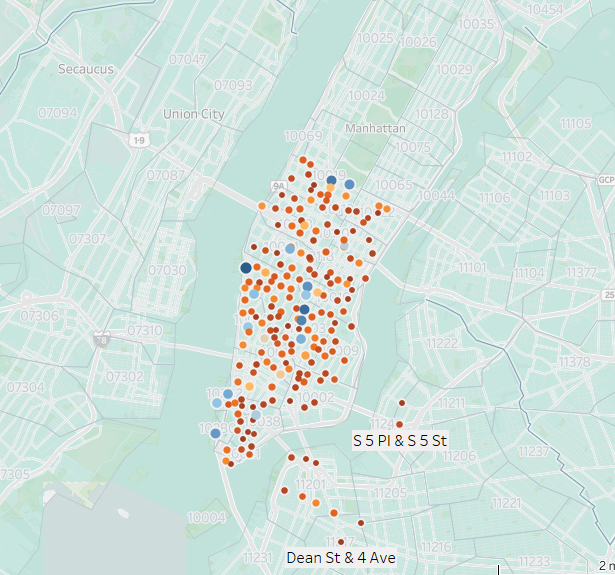

#**Executive summary**

Citibike serviced 337 stations in the Manhattan/Brooklyn are for the month of June 2013. A total of 577,704 trips were facilitated and 5795 unique bike ids were in service.
The following Tableau story is an overview of activities, geography and utilization for that month.

**Key takeaways were**
*	Top origin and destination stations overlap and facilitate >5000 trips each/month. Smaller stations (perhaps "home" stations ) facilitate 1000-2000 trips per year including those in Brooklyn
*	If not an error we are starting to see people self- report a third gender (non-male/female); this may need to be investigated for marketing purposes. If a survey was used this may need to be reviewed for wording of questions and the percentages compared with census demographics for the area.
*	Key demographics in the service area are predominantly in the 25-45 age group (census data overlay).
*	Ridership predominantly reflects this age demographic. However, we also see longer distances are undertaken by those > 60 years old; perhaps an overlooked target population.
*	The burden of high utilization appears to fall on select bikes and select stations; this bears further scrutiny. Both bikes and stations should be reviewed for additional maintenance and a needs assessment performed. 

**Phenomena:**
Both the bike utilization and age range utilization lend themselves to dashboard metrics that can be linked to actionable goals.

a)	Drill down into age ranges to determine need and types of bike riding; perhaps they are complementary (peak demand for workers during the week and peak demand for recreational use on the weekend- consider redistributing bikes during peak times and exploring demand by older age groups ; consider how media used to reach this demographic might differ from those in the 20-40 group.

b)	Bikes can be tracked by id. Map locations and trip duration can be filtered by bike id to gain a better understanding of patterns of use and facilitate problem solving for bike maintenance and rotation. Consider active rotation of bikes at stations that are consistent origin and destination for rides of longer duration.

